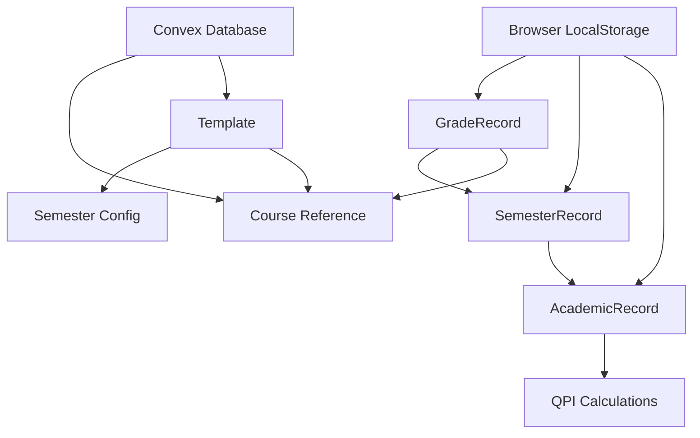

# Data Model: QPI Calculator

## Convex Database Entities (Persistent)

### Course Table
Represents individual academic subjects that can be reused across templates.

```typescript
// convex/schema.ts
courses: defineTable({
  courseCode: v.string(),    // e.g., "ENGS101", "MATH101"
  title: v.string(),         // e.g., "English Communication", "Calculus I"
  units: v.number(),         // Credit hours, typically 1-6
  createdAt: v.number(),     // Timestamp for ordering
  updatedAt: v.number(),     // Last modification timestamp
})
.index("by_code", ["courseCode"])
.index("by_creation", ["createdAt"])
```

**Validation Rules**:
- `courseCode`: Required, 3-20 characters, alphanumeric with hyphens
- `title`: Required, 1-200 characters
- `units`: Required, positive number, typically 0.5-6.0
- Unique constraint on `courseCode`

### Template Table  
Represents course-specific academic programs with predefined semester structures.

```typescript
// convex/schema.ts
templates: defineTable({
  name: v.string(),          // e.g., "Computer Science Program", "Engineering Track"
  description: v.optional(v.string()), // Optional program description
  semesters: v.array(v.object({
    yearLevel: v.number(),   // 1, 2, 3, 4 (year in program)
    semesterType: v.union(   // "first", "second", "summer"
      v.literal("first"),
      v.literal("second"), 
      v.literal("summer")
    ),
    courses: v.array(v.id("courses")), // References to course documents
  })),
  createdAt: v.number(),
  updatedAt: v.number(),
})
.index("by_name", ["name"])
.index("by_creation", ["createdAt"])
```

**Validation Rules**:
- `name`: Required, unique, 1-100 characters
- `yearLevel`: 1-6 (supports graduate programs)
- `semesterType`: Must be one of the three defined values
- `courses`: Array of valid course references, max 15 per semester
- At least one semester required per template

## Local Storage Entities (Client-side)

### Grade Record
Represents a student's grade for a specific course in a specific semester.

```typescript
interface GradeRecord {
  id: string;                // UUID for local tracking
  courseId: string;          // Reference to Convex course ID
  courseCode: string;        // Cached for display (denormalized)
  courseTitle: string;       // Cached for display (denormalized)
  units: number;             // Cached from course (denormalized)
  numericalGrade?: number;   // 0-100, optional until entered
  letterGrade?: string;      // A, B+, B, C+, C, D+, D, F (calculated)
  gradePoint?: number;       // 0.0-4.0 (calculated from numerical)
  qualityPoints?: number;    // units * gradePoint (calculated)
  semesterId: string;        // Reference to semester
  notes?: string;            // Optional student notes
  createdAt: number;
  updatedAt: number;
}
```

### Semester Record
Represents an academic semester with associated grades and calculations.

```typescript
interface SemesterRecord {
  id: string;                // UUID
  yearLevel: number;         // 1, 2, 3, 4
  semesterType: 'first' | 'second' | 'summer';
  academicYear: string;      // e.g., "2023-2024"
  grades: string[];          // Array of GradeRecord IDs
  totalUnits?: number;       // Sum of all course units (calculated)
  totalQualityPoints?: number; // Sum of all quality points (calculated)
  semesterQPI?: number;      // totalQualityPoints / totalUnits (calculated)
  isCompleted: boolean;      // Whether semester is finished
  createdAt: number;
  updatedAt: number;
}
```

### Academic Record (Root Document)
Represents the complete academic history and calculations for a student.

```typescript
interface AcademicRecord {
  id: string;                // Usually "main" (single record per user)
  semesters: string[];       // Array of SemesterRecord IDs
  totalUnits?: number;       // Cumulative units across all semesters
  totalQualityPoints?: number; // Cumulative quality points
  cumulativeQPI?: number;    // Overall GPI calculation
  yearlyQPIs: Array<{        // QPI calculations by academic year
    academicYear: string;
    firstSemQPI?: number;
    secondSemQPI?: number;  
    summerQPI?: number;
    yearlyQPI?: number;      // Average of semester QPIs
  }>;
  configuration: {
    totalYears: number;      // Number of academic years (1-6)
    includesSummer: boolean; // Whether student takes summer classes
  };
  lastCalculated: number;    // Timestamp of last QPI calculation
  version: number;           // Schema version for migrations
  createdAt: number;
  updatedAt: number;
}
```

## Grade Point Mapping

### Numerical to Letter Grade Conversion
```typescript
const GRADE_SCALE = {
  'A':  { min: 98, max: 100, points: 4.0 },
  'B+': { min: 94, max: 97,  points: 3.5 },
  'B':  { min: 90, max: 93,  points: 3.0 },
  'C+': { min: 86, max: 89,  points: 2.5 },
  'C':  { min: 82, max: 85,  points: 2.0 },
  'D+': { min: 78, max: 81,  points: 1.5 },
  'D':  { min: 75, max: 77,  points: 1.0 },
  'F':  { min: 0,  max: 74,  points: 0.0 },
} as const;
```

## Calculation Formulas

### Subject Level
- **Quality Points**: `units × gradePoint`
- **Letter Grade**: Lookup based on numerical grade using scale above

### Semester Level  
- **Total Units**: Sum of all course units in semester
- **Total Quality Points**: Sum of all (units × gradePoint) in semester
- **Semester QPI**: `totalQualityPoints ÷ totalUnits`

### Yearly Level
- **Regular Year**: `(firstSemesterQPI + secondSemesterQPI) ÷ 2`
- **With Summer**: Include summer QPI in weighted average based on units

### Cumulative Level
- **Cumulative QPI**: `totalQualityPoints (all semesters) ÷ totalUnits (all semesters)`

## Data Relationships



## State Transitions

### Grade Entry Flow
1. **Empty State**: Grade record exists with course info, no numerical grade
2. **Grade Entered**: User inputs numerical grade (0-100)
3. **Calculated State**: Letter grade and quality points automatically calculated
4. **Semester Updated**: Semester totals recalculated
5. **Academic Record Updated**: Cumulative QPI recalculated

### Template Application Flow  
1. **Template Selected**: User chooses course template
2. **Semesters Created**: Local semester records generated from template
3. **Grades Initialized**: Empty grade records created for each course
4. **Ready for Input**: User can begin entering grades

### Data Export/Import Flow
1. **Export**: Academic record serialized to CSV with all calculations
2. **Import**: CSV parsed and validated against expected schema
3. **Merge/Replace**: User chooses how to handle existing data
4. **Recalculation**: All QPI values recalculated after import